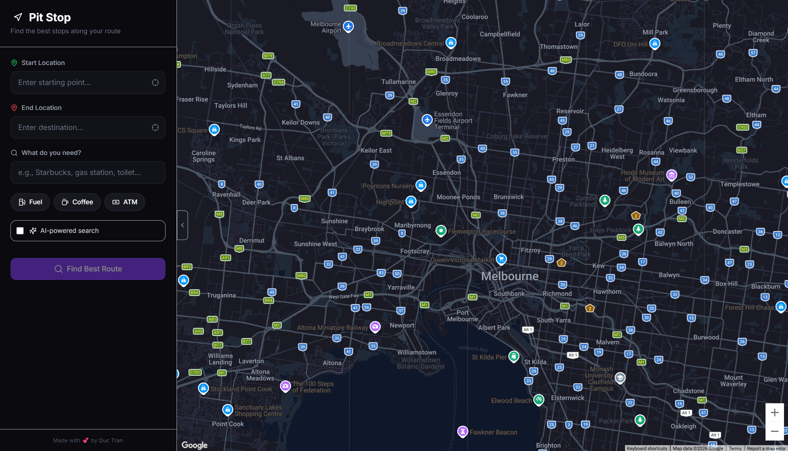
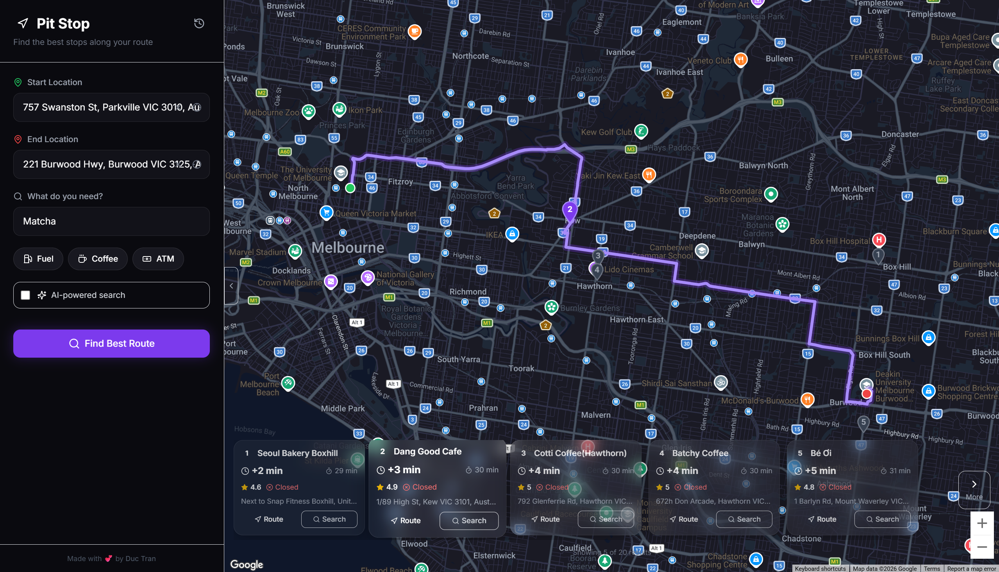
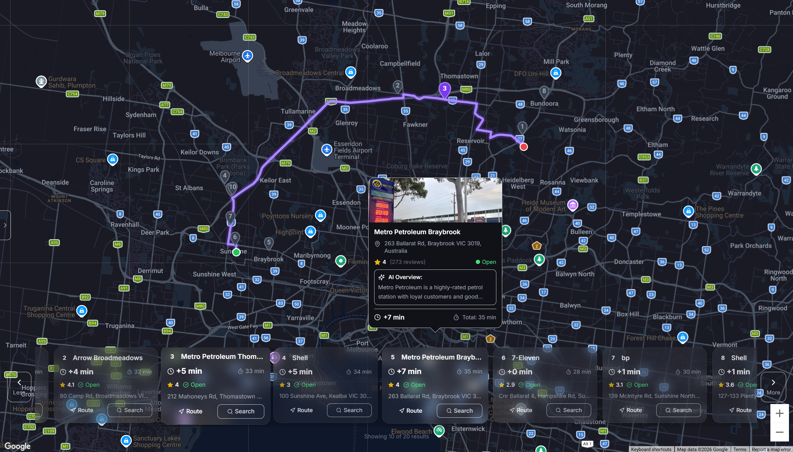

# Pit Stop

A full-stack route optimization web application that finds optimal intermediate stops along driving routes. Built with React, Express, Google Maps Platform APIs, and Google Gemini AI.

## Table of Contents

- [Overview](#overview)
- [Features](#features)
- [Tech Stack](#tech-stack)
- [Architecture](#architecture)
- [Screenshots](#screenshots)
- [Getting Started](#getting-started)
- [Environment Variables](#environment-variables)
- [API Endpoints](#api-endpoints)
- [Deployment](#deployment)
- [License](#license)

## Overview

Pit Stop solves the problem of finding the best places to stop during a road trip while minimizing detour time. Users enter their start and end locations, specify what they need (coffee, gas, ATM, etc.), and the application returns optimized results ranked by minimal detour time.

The application integrates multiple Google Cloud services and demonstrates advanced patterns including bathed API requests and client-side data persistence.

## Features

### Core Functionality

- **Route Optimization**: Calculates detour time for each potential stop along a route
- **Multi-criteria Search**: Search for any type of establishment (cafes, gas stations, restaurants, etc.)
- **AI-Powered Analysis**: Optional Gemini AI integration analyzes place reviews to match user intent for enhanced search results
- **Interactive Map**: Real-time route visualization with selectable pit stop markers

### Technical Highlights

**Google Maps Platform Integration**

- Routes API for optimal path computation
- Places API (New) for location search with reviews and photos
- Geocoding API for address resolution
- Custom dark-themed map styling with glassmorphism UI

**Gemini AI Integration**

- Batched prompts for efficient API usage (single request for 20+ places)
- Multi-model failover (gemini-2.5-flash-lite, gemini-2.5-flash, gemini-3-flash-preview)
- Multi-key rotation with automatic quota management
- Configurable retry logic with cooldown periods

**Geolocation Services**

- IP-based location detection for initial map centering
- Browser Geolocation API for precise current location
- Location-biased autocomplete suggestions

**Client-Side Data Persistence**

- Search history stored in browser localStorage
- No database required for user preferences
- Privacy-focused architecture

**User Experience**

- Responsive dark-themed UI with glassmorphism design
- Hover tooltips with detailed place information
- Collapsible sidebar for expanded map view
- Horizontal scrollable results carousel with pagination
- Quick-access chips for common searches

### Security

- Helmet.js for HTTP security headers
- Rate limiting (100 requests per 15 minutes)
- CORS configuration for production environments
- Environment-based configuration

## Tech Stack

### Frontend

| Technology             | Purpose                      |
| ---------------------- | ---------------------------- |
| React 18               | UI framework                 |
| Vite                   | Build tool and dev server    |
| Tailwind CSS           | Utility-first styling        |
| @react-google-maps/api | Google Maps React components |
| Lucide React           | Icon library                 |

### Backend

| Technology            | Purpose             |
| --------------------- | ------------------- |
| Node.js               | Runtime environment |
| Express               | Web framework       |
| @google/generative-ai | Gemini AI SDK       |
| Helmet                | Security middleware |
| express-rate-limit    | API rate limiting   |

### External Services

| Service                      | Purpose                     |
| ---------------------------- | --------------------------- |
| Google Maps Routes API       | Route computation           |
| Google Maps Places API (New) | Location search and details |
| Google Maps Geocoding API    | Address resolution          |
| Google Gemini AI             | Review analysis             |
| ipapi.co / ip-api.com        | IP geolocation              |

## Architecture

```
pit-stop/
├── client/                     # React frontend
│   ├── src/
│   │   ├── components/         # React components
│   │   │   ├── MapContainer.jsx
│   │   │   ├── Sidebar.jsx
│   │   │   ├── ResultsCarousel.jsx
│   │   │   ├── LocationAutocomplete.jsx
│   │   │   └── LoadingOverlay.jsx
│   │   ├── services/           # API client
│   │   ├── styles/             # Global styles
│   │   └── App.jsx             # Main application
│   └── package.json
├── server/                     # Express backend
│   ├── routes/
│   │   └── optimizeRoutes.js   # API endpoints
│   ├── services/
│   │   ├── googleMapsService.js
│   │   └── geminiService.js
│   └── server.js               # Entry point
└── package.json                # Root package with scripts
```

## Project Snapshots

### Main Interface



### Route Visualization



### AI-Powered Search



## Getting Started

### Prerequisites

- Node.js 18+
- Google Cloud account with billing enabled
- Google Maps API key with the following APIs enabled:
  - Maps JavaScript API
  - Routes API
  - Places API (New)
  - Geocoding API
- (Optional) Gemini API key from [Google AI Studio](https://makersuite.google.com/app/apikey)

### Installation

```bash
# Clone the repository
git clone https://github.com/chimdienn/PitStop.git
cd pit-stop

# Install all dependencies
npm run install:all

# Configure server environment variables
cp server/.env.example server/.env
# Edit server/.env with your API keys

# Create client environment file
echo "VITE_GOOGLE_MAPS_API_KEY=your_key_here" > client/.env

# Start development servers
npm run dev
```

The application will be available at `http://localhost:5173`.

## Environment Variables

### Server (`server/.env`)

| Variable              | Required   | Description                                   |
| --------------------- | ---------- | --------------------------------------------- |
| `PORT`                | No         | Server port (default: 5000)                   |
| `NODE_ENV`            | No         | Environment (development/production)          |
| `GOOGLE_MAPS_API_KEY` | Yes        | Google Cloud API key for server-side requests |
| `GEMINI_API_KEY`      | No         | Primary Gemini API key                        |
| `GEMINI_API_KEY_2`    | No         | Secondary Gemini API key for failover         |
| `FRONTEND_URL`        | Production | Frontend URL for CORS configuration           |

### Client (`client/.env`)

| Variable                   | Required   | Description                             |
| -------------------------- | ---------- | --------------------------------------- |
| `VITE_GOOGLE_MAPS_API_KEY` | Yes        | Google Maps JavaScript API key          |
| `VITE_API_URL`             | Production | Backend API URL (empty for same-origin) |

## API Endpoints

### POST /api/optimize

Find optimal pit stops along a route.

**Request Body:**

```json
{
  "origin": { "lat": 10.815, "lng": 106.688 },
  "destination": { "lat": 10.778, "lng": 106.701 },
  "query": "coffee shop",
  "maxResults": 20,
  "useAI": true
}
```

**Response:**

```json
{
  "success": true,
  "primaryRoute": {
    "durationSeconds": 1140,
    "distanceMeters": 5800,
    "encodedPolyline": "..."
  },
  "results": [
    {
      "rank": 1,
      "placeId": "ChIJ...",
      "name": "Starbucks Reserve",
      "address": "117 Swanston St, Melbourne VIC 3000",
      "location": { "lat": 10.8, "lng": 106.69 },
      "rating": 4.5,
      "userRatingCount": 1250,
      "isOpen": true,
      "photoUrl": "https://...",
      "detour": {
        "minutes": 2,
        "seconds": 120,
        "addedText": "+2 min"
      },
      "detourRoute": {
        "encodedPolyline": "...",
        "durationSeconds": 1260,
        "distanceMeters": 6200
      },
      "aiAnalysis": {
        "confidence": 0.85,
        "explanation": "Highly rated for quality coffee and comfortable seating."
      },
      "googleMapsUrl": "https://www.google.com/maps/dir/..."
    }
  ],
  "totalCandidatesFound": 25
}
```

### POST /api/geocode

Convert address to coordinates.

**Request Body:**

```json
{
  "address": "Queen Victoria Market, Melbourne VIC 3000"
}
```

### GET /api/place/:placeId

Get detailed place information.

### GET /api/health

Health check endpoint for monitoring.

### Quick Deploy Summary

1. Push code to GitHub
2. Connect repository to Vercel
3. Configure environment variables in Vercel dashboard
4. Deploy

## Development

### Available Scripts

```bash
# Run both client and server in development
npm run dev

# Run only the server
npm run dev:server

# Run only the client
npm run dev:client

# Build client for production
npm run build

# Install all dependencies (root, client, server)
npm run install:all
```

### Project Structure Notes

- `client/`: React application with Vite
- `server/`: Express API server
- `api/`: Vercel serverless functions (for production deployment)

## License

MIT License

## Acknowledgments

- [Google Maps Platform](https://developers.google.com/maps) for mapping and places APIs
- [Google Gemini](https://ai.google.dev/) for AI-powered review analysis
